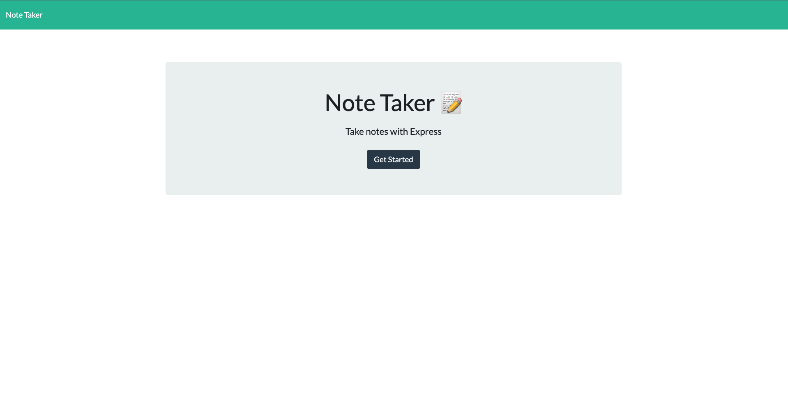
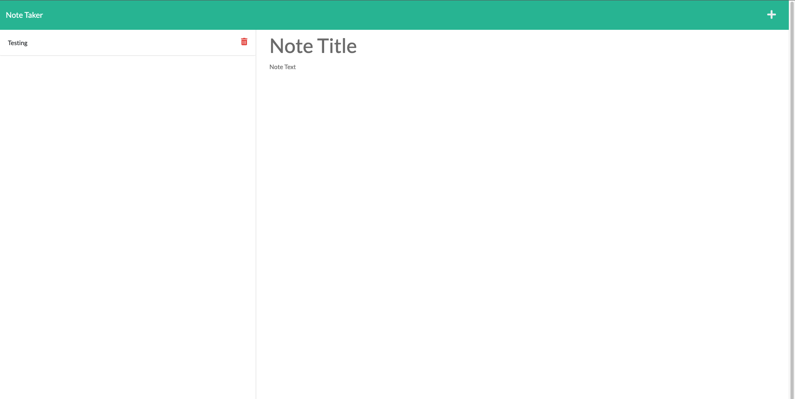

# Note Taker Web app  
  
## Description
        
            This is a basic notetaker, built with express,node.js,javascript,html, and CSS this web app is handy for jotting down notes no matter where you are. 

## Table of Contents
        
            - [Installation](#installation)
            - [Usage](#usage)
            - [Contributing](#contributing)
            - [Tests](#tests)
            - [Questions](#questions)
            - [Sources](#sources)
        
## Installation
        
            To access this application navigate to the deployed link at heroku: https://note-taker-jt-groceries.herokuapp.com/
          
## Usage
        
            This application can be used to keep track of notes and then have them stored to a database so you can come back to them whenever you would like. 
        
## License
        
            The mozilla license was used for this project.

## Contributing
        
            To contribute please reach out at the provided email.

## Tests
        
            N/A
        
 ## Questions?
        
            Contact Info:
            
            Github profile: Elbashadore https://github.com/Elbashadore
            
            Email: joshtibbetts12@gmail.com

            If you have any questions please reach out to me at the email address provided above. 
        
## Sources
            N/A